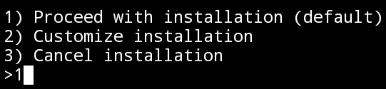
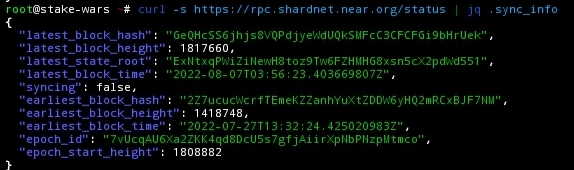
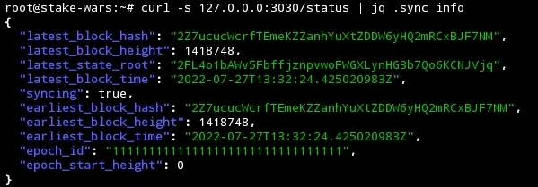
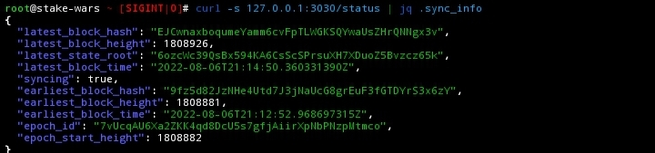
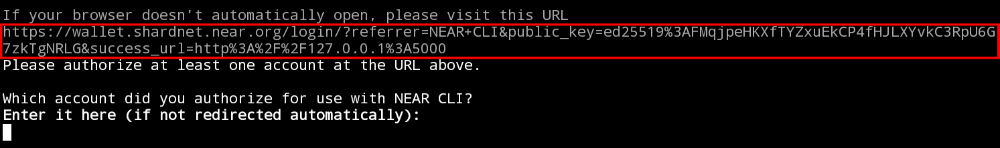
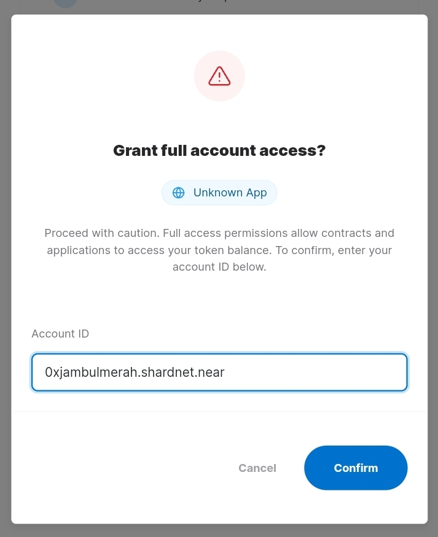
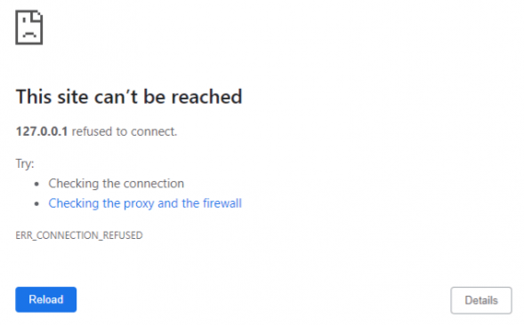
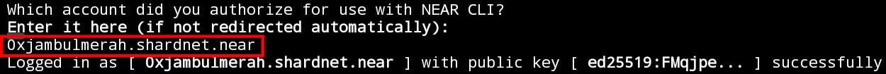
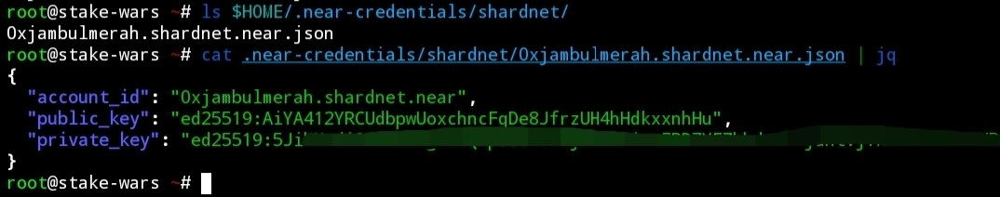

# Panduan cara menjalankan node validator dan memasang staking pool
Kali ini kita akan membahas tutorial cara menjalankan node sebagai validator dan memasang ataking pool di blockchain **NEARprotocol** pada jaringan testnet yang bernama **shardnet** dalam program **stakewars**
## Usefull link
* Official full-doc: https://near-nodes.io
* Wallet: https://wallet.shardnet.near.org
* Explorer: https://explorer.shardnet.near.org

## Server VPS minimum yang di butuhkan
| Hardware       | Chunk-Only Producer  Specifications                                   |
| -------------- | ---------------------------------------------------------------       |
| CPU            | 4-Core CPU with AVX support                                           |
| RAM            | 8GB DDR4                                                              |
| Storage        | 500GB SSD                                                             |

Kali ini saya menggunakan platform microsoft azure sebagai penyedia layanan cloud dan VM. Ini adalah spesifikasi VM milik saya


### Check fitur cpu
Sebelum memulai, Anda mungkin ingin memastikan bahwa mesin Anda memiliki fitur CPU yang tepat. 
Use command:
```
lscpu | grep -P '(?=.*avx )(?=.*sse4.2 )(?=.*cx16 )(?=.*popcnt )' > /dev/null && echo "Supported" || echo "Not supported"
```
Jika output yang ditampilkan `Supported` mari kita lanjutkan langkah demi langkahnya.
### Create shardnet wallet
Link: https://shardnet.near.org
## Install and setup near-cli
NEAR-CLI adalah antarmuka baris perintah yang berkomunikasi dengan blockchain NEAR melalui panggilan prosedur jarak jauh (RPC):
> **NOTE**: Untuk alasan keamanan, disarankan agar NEAR-CLI diinstal pada komputer yang berbeda dari node validator Anda dan tidak ada kunci akses penuh yang disimpan pada node validator Anda.

#### install develovers tool `node.js` dan `npm`
Pertama pastikan mesin linux up-to-date
Use command:
```
sudo apt update && sudo apt upgrade -y
```

Install `nodejs` dan `npm` dari sumber asli.
Use command:
```
curl -sL https://deb.nodesource.com/setup_18.x | sudo -E bash -  
sudo apt install build-essential nodejs
PATH="$PATH"
```
* Check versi `node.js` yang terisntall adalah versi `v18.x.x`
```
node -v
```

* Check versi `npm` yang terisntall adalah versi `8.x.x`
```
npm -v
```

#### Install n`ear-cli` menggunakan `npm`
```
sudo npm install -g near-cli

```
### Environment
Environment perlu diatur setiap kali shell baru diluncurkan untuk memilih jaringan yang benar.
Jaringan:

* Guildnet
* Testnet
* Mainnet
* **Shardnet**(ini adalah jaringan yang akan kita gunakan untuk Stake Wars)

Use command:
```
export NEAR_ENV=shardnet
```
Atau anda bisa mengatur environment secara permanen
Use command:
```
echo 'export NEAR_ENV=shardnet' >> ~/.bash_profile
source $HOME/.bash_profile
```

### Statistik validator
Sekarang setelah environment telah di konfigurasi, mari kita uji CLI dan gunakan perintah berikut untuk berinteraksi dengan blockchain serta untuk melihat statistik validator. Ada tiga laporan yang digunakan untuk memantau status validator di jaringan **shardnet**:

* 1- Proposals

Proposal oleh validator menunjukkan bahwa mereka ingin masuk ke set validator, agar proposal dapat diterima harus memenuhi harga kursi minimum.
Use command:
```
near proposals
```
Harga kursi yang diharapkan dihitung berdasarkan proposal dan validator yang diamati sejauh ini.
Itu dapat berubah dari proposal baru atau beberapa validator menjadi offline.
**Note**:: saat ini tidak memperhitungkan kickout offline dan hadiah untuk zaman saat ini

* 2- Validators current

Ini menunjukkan daftar validator aktif di zaman saat ini, jumlah blok yang diproduksi, jumlah blok yang diharapkan, dan tarif online. Digunakan untuk memantau jika validator mengalami masalah.
Use command:
```
near validators current
```

* 3- Validators next

Ini menunjukkan validator yang proposalnya diterima satu epoch yang lalu, dan yang akan masuk ke set validator di epoch berikutnya.
Use command:
```
near validators next
```
Satatus `New` adalah validator yang akan masuk ke set validator aktif pada epoch berikutnya, `Rewarded` Adalah validator aktif yang berhasil bertahan dari epoch sebelumnya, `Kicked out` Adalah validator yang akan  di keluarkan pada epoch berikutnya karna masalah tertentu

## Setup node 
#### Install dependencies

```
sudo apt install -y git binutils-dev libcurl4-openssl-dev zlib1g-dev libdw-dev libiberty-dev cmake gcc g++ python3-pip protobuf-compiler libssl-dev pkg-config clang llvm build-essential make ccze jq -y
```
#### Install docker
```
sudo apt-get install ca-certificates curl gnupg lsb-release -y
curl -fsSL https://download.docker.com/linux/ubuntu/gpg | sudo gpg --dearmor -o /usr/share/keyrings/docker-archive-keyring.gpg
echo "deb [arch=$(dpkg --print-architecture) signed-by=/usr/share/keyrings/docker-archive-keyring.gpg] https://download.docker.com/linux/ubuntu $(lsb_release -cs) stable" | sudo tee /etc/apt/sources.list.d/docker.list > /dev/null
sudo apt-get update && sudo apt-get install docker-ce docker-ce-cli containerd.io -y
```
#### Set konfigurasi
```
USER_BASE_BIN=$(python3 -m site --user-base)/bin
export PATH="$USER_BASE_BIN:$PATH"
```
#### Install `rust`dan `cargo`
```
curl --proto '=https' --tlsv1.2 -sSf https://sh.rustup.rs | sh
```
Akan ada konfirmasi penginstall seperti ini.



Ketik 1 kemudian enter

#### Source environment
```
source $HOME/.cargo/env
```

### Clone `nearcore` repository

```
git clone https://github.com/near/nearcore
cd nearcore
git fetch
```
Checkout commit
```
git checkout 68bfa84ed1455f891032434d37ccad696e91e4f5
```
Atau anda bisa melihat commit [disini](https://github.com/near/stakewars-iii/blob/main/commit.md)

### Compile binary
```
cargo build -p neard --release --features shardnet
```
Jalur biner adalah target/release/neard. Jika Anda melihat masalah, mungkin perintah kargo tidak ditemukan. Kompilasi nearcore biner mungkin memakan waktu agak lama.

#### Pindahkan binary ke /usr/local/bin/
```
mv ~/nearcore/target/release/neard /usr/local/bin
```
#### Init working directory
Agar berfungsi dengan baik, node NEAR memerlukan direktori kerja dan beberapa file konfigurasi. Hasilkan direktori kerja awal yang diperlukan dengan menjalankan:
```
neard --home ~/.near init --chain-id shardnet --download-genesis
```
Perintah ini akan membuat struktur direktori dan akan menghasilkan `config.json`, `node_key.json`, dan `genesis.json` pada jaringan yang telah Anda lewati.

* `config.json`- Parameter konfigurasi yang responsif terhadap cara kerja node. config.json berisi informasi yang diperlukan agar node dapat berjalan di jaringan, cara berkomunikasi dengan peer, dan cara mencapai konsensus. Meskipun beberapa opsi dapat dikonfigurasi. Secara umum validator telah memilih untuk menggunakan config.json default yang disediakan.

* `genesis.json`- File dengan semua data yang dimulai jaringan di genesis. Ini berisi akun awal, kontrak, kunci akses, dan catatan lain yang mewakili keadaan awal blockchain. File genesis.json adalah snapshot dari status jaringan pada suatu titik waktu. Di akun kontak, saldo, validator aktif, dan informasi lain tentang jaringan.

* `node_key.json`- Sebuah file yang berisi kunci publik dan pribadi untuk node. Juga termasuk parameter opsional `--account_id` yang diperlukan untuk menjalankan node validator (tidak tercakup dalam dokumen ini, Nanti kita akan buat manual `validator_key.json` Di depan ).

* `data/`- Folder di mana node NEAR akan menulis statusnya.

#### Ganti file `config.json`

Dari yang dihasilkan `config.json`, ada dua parameter untuk dimodifikasi:

* `boot_nodes`: Jika Anda belum menentukan node boot yang akan digunakan selama init di Langkah 3, yang dihasilkan config.jsonmenunjukkan array kosong, jadi kita perlu menggantinya dengan yang lengkap yang menentukan node boot.

* `tracked_shards`: Di generate `config.json`, field ini kosong. Anda harus menggantinya ke"`tracked_shards": [0]`

Use command
```
rm ~/.near/config.json
wget -O ~/.near/config.json https://s3-us-west-1.amazonaws.com/build.nearprotocol.com/nearcore-deploy/shardnet/config.json
```
Sebenarnya kita bisa juga menggunakan parameter `--download-config-url` saat init sebelumnya

## Run the node
* Buat service systemd
```
sudo tee /etc/systemd/system/neard.service > /dev/null <<EOF
[Unit]
Description=NEARd Daemon Service

[Service]
Type=simple
User=$USER
#Group=near
WorkingDirectory=$HOME/.near
ExecStart=$(which neard) run
Restart=on-failure
RestartSec=30
KillSignal=SIGINT
TimeoutStopSec=45
KillMode=mixed

[Install]
WantedBy=multi-user.target
EOF
```
* Enable service
```
sudo systemctl enable neard
```
* Start service
```
sudo systemctl start neard
```
* Lihat log nya
```
journalctl -fu neard | ccze -A
```

Node sedang berjalan, Anda dapat melihat output log di konsol Anda. Node Anda harus menemukan rekan, mengunduh tajuk hingga 100%, dan kemudian mengunduh blok.


#### Melihat status block sync di rpc pusat

Untuk mengetahui ketinggian block saat ini
```
curl -s https://rpc.shardnet.near.org/status | jq .sync_info
```


`latest_block_height` adalah ketinggian block pada saat output ini di tampilkan

#### Melihat status sync di node rpc lokal milik anda

```
curl -s 127.0.0.1:3030/status
```



* Nilai `"epoch_id"` adalah `"111111111"` Berarti headers belum sepenuhnya 100% terunduh



* Nilai `"epoch_id"` sudah berubah menunjukan headers 100% sepenuhnya terunduh. Tetapi nilai status `"syncing"` masih `"true"` menunjukan block masih proses sinkronisasi

## Mengaktifkan node sebagai validator

#### Otorisasi dompet secara lokal

Kunci akses penuh perlu diinstal secara lokal untuk dapat menandatangani transaksi melalui NEAR-CLI.
Use command:
```
near login
```
> **NOTE**: Perintah ini meluncurkan browser web yang memungkinkan otorisasi kunci akses penuh untuk disalin secara lokal

* 1 - Salin dan paste link yang di berikan di web browser



> **NOTE**: Pastikan subdomain url adalah wallet.**shardnet**.near.org karna kita akan menggunkan jaringan shardnet 

* 2 - Enter your wallet name dan berikan  akses ke NEAR-CLI



* 3 - Setelah grant anda akan melihat halaman seperti ini. jangan panik, kembli ke konsol



* 4 - Enter your wallet and press enter



* 5 - Check your wallet

Setelah sukses anda akan mendapatkan file json di `$HOME/.near-credentials/shardnet/` sama dengan nama wallet anda. Di dalamnya berisi `account_id`, `public_key` dan `private_key` 

```
ls $HOME/.near-credentials/shardnet/
```
```
cat $HOME/.near-credentials/shardnet/*shardnet.near.json
```



##### Set up Vars `account_id` dan `pool_id`

```
echo 'export account_id=$(cat .near-credentials/shardnet/*.shardnet.near.json | jq -r .account_id)' >> ~/.bash_profile
echo 'export pool_id=$(cat .near-credentials/shardnet/0xjambulmerah.shardnet.near.json | jq -r .account_id | sed "s/shardnet/factory.shardnet/")' >> ~/.bash_profile
source ~/.bash_profile
```
##### Buat file `validator_key.json`
###### 
